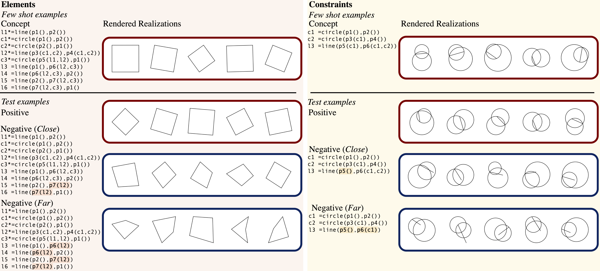

# Geoclidean: Few-Shot Generalization in Euclidean Geometry




## Prerequisites
`pip install Shapely` and `pip install descartes`.

## Data
The Geoclidean-Elements and Geoclidean-Constraints dataset can be downloaded [here](https://downloads.cs.stanford.edu/viscam/Geoclidean/geoclidean.zip). The data is structured as following:
```
geoclidean    
│
└───elements
│   │
│   └───concept_name
│       │   concept.txt
│       │   close_concept.txt
│       │   far_concept.txt
│       │   train
│       │   │   1_fin.png
│       │   │   2_fin.png
│       │   │   3_fin.png
│       │   │   4_fin.png
│       │   │   5_fin.png
│       │   test
│       │   │   in_1_fin.png -> derived from concept.txt
│       │   │   in_2_fin.png
│       │   │   in_3_fin.png
│       │   │   in_4_fin.png
│       │   │   in_5_fin.png
│       │   │   out_close_1_fin.png -> derived from close_concept.txt
│       │   │   out_close_2_fin.png
│       │   │   out_close_3_fin.png
│       │   │   out_close_4_fin.png
│       │   │   out_close_5_fin.png
│       │   │   out_far_1_fin.png -> derived from far_concept.txt
│       │   │   out_far_2_fin.png
│       │   │   out_far_3_fin.png
│       │   │   out_far_4_fin.png
│       │   │   out_far_5_fin.png
│       ...
│   
└───constraints
    │   ...

```


## Geoclidean DSL and Rendering
See examples of Euclidean geometry language to image rendering in `dataset_creation.ipynb`.


### Primitives:
- Point: `p1(), p1(object1), p1(object1, object2)` (where parentheses indicates constraints)
- Line: `line(p1(), p2())`  (points initialized inline)
- Circle: `circle(p1(), p2())`
    
### Syntax:
- Object statement: `l1 = line(p1(), p2())` (`l1` can be any name)
- Invisible object statement: `l1* = line(p1(), p2())` (`*` denotes helper objects not rendered)
- Concept: `[statement, statement, ...]`


## Model Benchmarking

### Feature extraction:
See feature extraction for VGG16, ResNet50, and IncepeptionV3 in `feature_extraction_cnn.ipynb`, and for Vision Transformer in `feature_extraction_vit.ipynb`.

### Benchmarking:
See accuracy and AUC calculation in `model_benchmarks.ipynb`.


